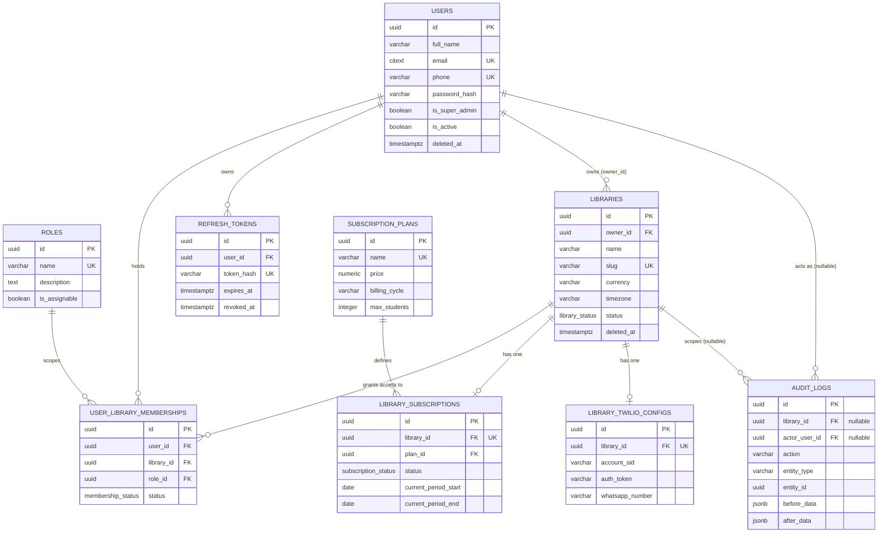
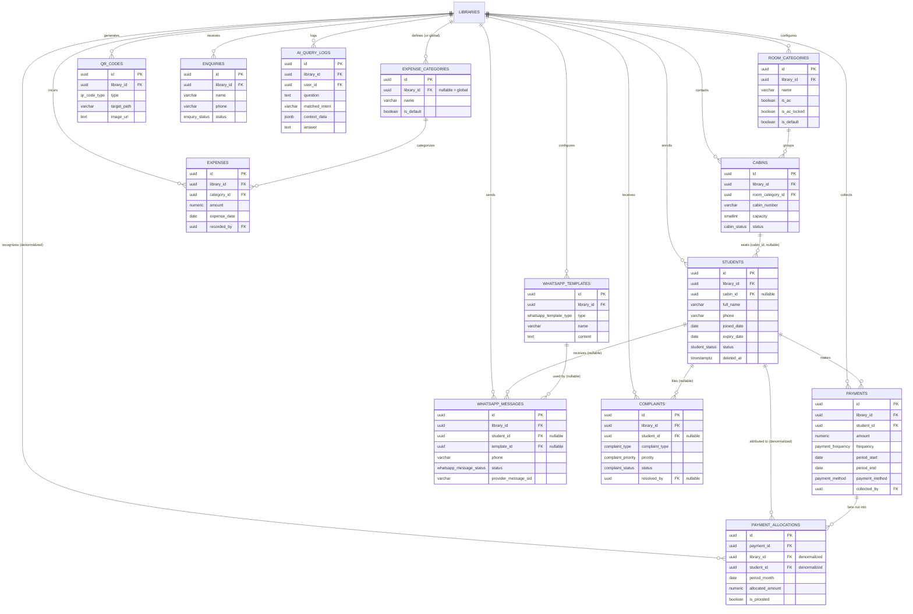

# Study Library Management System — ER Diagram

**Module 3 of 20 — ER Diagram**
Depends on: [DATABASE_DESIGN.md](./DATABASE_DESIGN.md) (Module 2 — full column/constraint spec)
This document is the visual companion to that schema — open it in a Markdown preview that
renders Mermaid (VS Code with the Markdown Preview Mermaid extension, GitHub, GitLab, etc.) to
see the diagrams rendered.

The full schema (22 tables) is split into two diagrams for readability:
1. **Core Tenancy & Identity** — users, roles, libraries, memberships, subscriptions, audit
2. **Operational Domain** — rooms, cabins, students, payments, expenses, WhatsApp, QR, complaints, AI

`libraries` appears in both diagrams as the shared anchor point.

---

## Diagram 1 — Identity, Tenancy & Subscription

---

## Diagram 2 — Operational Domain

---

## How to read the cardinalities

| Notation | Meaning | Example in this schema |
|---|---|---|
| `\|\|--o{` | one-to-many, "many" side optional | one `LIBRARY` has many `STUDENTS` |
| `\|\|--o\|` | one-to-zero-or-one | one `LIBRARY` has at most one `LIBRARY_SUBSCRIPTIONS` row |
| `cabin_id FK "nullable"` | optional FK | a `STUDENT` may have no assigned `CABIN` yet |
| `library_id FK "denormalized"` | FK that is also reachable transitively (via `payment_id`) but stored directly for query performance — see Module 2 §9 | `PAYMENT_ALLOCATIONS.library_id` |

## Key relationship notes (cross-referencing Module 2)

- **`USERS` ↔ `LIBRARIES` is many-to-many**, mediated by `USER_LIBRARY_MEMBERSHIPS` — not a direct
  FK — because one user can own/work at multiple libraries, each with a different role.
- **`CABINS` ↔ `STUDENTS`** is a one-to-many stored as a single FK on `STUDENTS.cabin_id`
  (nullable). There is deliberately no reciprocal `CABINS.current_student_id` column — occupancy
  status on `cabins.status` is maintained by the service layer whenever `students.cabin_id`
  changes, avoiding a two-source-of-truth problem.
- **`PAYMENTS` → `PAYMENT_ALLOCATIONS`** is the revenue-recognition fan-out: one payment (e.g.
  ₹9000 for 6 months) produces multiple allocation rows (₹1500 × 6, one per calendar month). All
  revenue reporting joins/aggregates on `PAYMENT_ALLOCATIONS`, never raw `PAYMENTS.amount`.
- **`EXPENSE_CATEGORIES` and `AUDIT_LOGS`** have a nullable `library_id`: `NULL` means a
  platform-global row (default expense categories, platform-level audit entries), visible to
  every tenant under the RLS policy defined in Module 2 §14.
- **`ROLES` and `SUBSCRIPTION_PLANS`** are global lookup tables with no `library_id` at all — not
  shown with a `library_id`-based relationship since they're platform-wide, referenced by FK from
  tenant tables (`USER_LIBRARY_MEMBERSHIPS.role_id`, `LIBRARY_SUBSCRIPTIONS.plan_id`).

---

## Next Step

Module 4 will define the **Folder Structure** for both the FastAPI backend and the React
frontend, mapping each domain shown above to a concrete feature module/directory — so the
Clean Architecture layering from Module 1 and the schema from Module 2 have a physical home
before any code is written.

Please review the two diagrams above (open this file's Markdown preview to see them rendered)
and confirm before Module 4.
